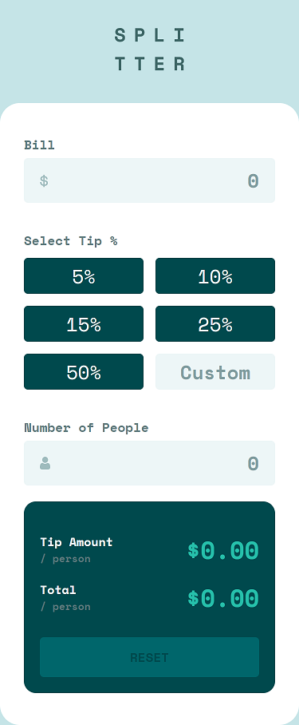

# Frontend Mentor - Tip calculator app solution

This is a solution to the [Tip calculator app challenge on Frontend Mentor](https://www.frontendmentor.io/challenges/tip-calculator-app-ugJNGbJUX). Frontend Mentor challenges help you improve your coding skills by building realistic projects.

Difficulty: Level 2 (Junior)

## Overview

### The challenge

Users should be able to:

- View the optimal layout for the app depending on their device's screen size
- See hover states for all interactive elements on the page
- Calculate the correct tip and total cost of the bill per person

### Links

- Live Site URL: [https://jordansgit.github.io/tip-calculator-app/](https://jordansgit.github.io/tip-calculator-app/)

### Built with

- HTML5 
- CSS 
- JavaScript

### Screenshot

Desktop 

Active States 

Tablet

Mobile

